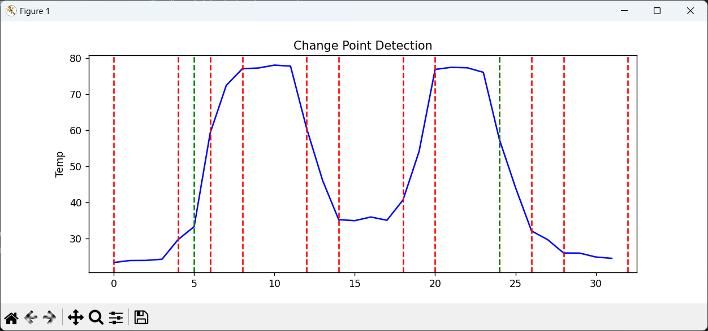

# Warmtesensor systeem

Deze package is gemaakt om de [Melexis MLX90640](https://www.melexis.com/en/product/MLX90640/Far-Infrared-Thermal-Sensor-Array) sensor te gebruiken in een python project. Deze package is gemaakt om meerdere sensoren tegelijk te gebruiken. De package is gebaseerd op de [mlx9064x-driver-py](https://github.com/melexis-fir/mlx90640-driver-py) package.

Deze package word geimplementeerd in een [kivy](https://kivy.org/#home) project die de temperatuur van palets moet monitorren. Dit project is niet inbegrepen in deze package.

## Showcase

Met de [melexis software](https://www.melexis.com/en/documents/tools/tools-evb90640-software-exe) kan je gemakklijk het beeld van de sensor bekijken. Hier is een voorbeeld van een sensor die een warmtebron detecteert.


Met deze package kun je meerdere sensoren terzelfde tijd uitlezen. Hier is een voorbeeld van 5 sensoren die een warmtebron detecteren.


Beelden kunnen ook gecropt worden. Het programma gaat automatisch de beste plaats zoeken om te croppen. Hier word een rij aan pixels van het beeld geanalyseerd en de plaats waar de meeste warmte is word gekozen. De rode lijnen zijn veranderingen in temperatuur die het detecteerd. De groene lijnen zijn de plaatsen waar het de crop gaat doen.



Als er geen grote verschillen in temperatuur gevonden zijn zal het progamma geen crop uitvoeren. Hier is een voorbeeld van een frame waar geen crop is uitgevoerd.


Deze package kan ook alerts geven. Hier is een voorbeeld van een alert die gegeven word als de temperatuur boven de x°C komt. De alert word weergegeven in een [kivy](https://kivy.org/#home) window. (Deze software is niet inbegrepen in deze package)


De getriggerde alerts worden ook opgeslagen naar afbeeldingen. Voorbeelden van alerts die getriggerd en opgeslagen zijn vind je in [`resources/images/alerts/`](./resources/images/alerts/).

## Inhoudstafel

- [Warmtesensor systeem](#warmtesensor-systeem)
  - [Showcase](#showcase)
  - [Inhoudstafel](#inhoudstafel)
  - [Aanpassingen mlx9064x-driver-py](#aanpassingen-mlx9064x-driver-py)
    - [Installatie](#installatie)
    - [Aanpassingen](#aanpassingen)
      - [`mlx/hw_usb_evb90640.py`](#mlxhw_usb_evb90640py)
      - [`mlx/mlx90640.py`](#mlxmlx90640py)
  - [Opmerkingen](#opmerkingen)
  - [IC Addressen](#ic-addressen)
  - [Configuratie](#configuratie)
    - ["default"](#default)
      - ["attempts": number](#attempts-number)
      - ["crop": object](#crop-object)
        - [Hard coded coordinates](#hard-coded-coordinates)
        - [Dynamic](#dynamic)
        - [Combinatie](#combinatie)
      - ["offset": number](#offset-number)
      - ["outlier\_threshold": number](#outlier_threshold-number)
      - ["threshold": (number, number)](#threshold-number-number)
      - ["alerts": object\[\]](#alerts-object)
    - ["sensors": object\[\]](#sensors-object)
      - ["addr": number | string](#addr-number--string)
      - [andere keys](#andere-keys)
    - [Voorbeeld](#voorbeeld)

## Aanpassingen mlx9064x-driver-py

Aangezien er bugs in [de mlx9064x-driver-py python package](https://github.com/melexis-fir/mlx9064x-driver-py) zitten moet deze manueel gedownload worden. Zie hiervoor [installatie](#installatie)

De gebruikte versie van de mlx9064x-driver-py python package is `v1.3.0`.

### Installatie

Downloaden kan op [deze link](https://github.com/melexis-fir/mlx9064x-driver-py/archive/refs/tags/V1.3.0.zip). Je plaatst deze in de root folder van deze workspace.

Na het downloaden van het `.zip` bestand pak je deze uit, en plaats je de `mlx/` folder in de root directory van deze workspace.

```shell
Expand-Archive -Path ".\mlx9064x-driver-py-1.3.0.zip" -DestinationPath ".\"
```

```shell
Move-Item -Path ".\mlx9064x-driver-py-1.3.0\mlx" -Destination ".\"
```

De rest van de gedownloadde bestanden heb je niet nodig, deze kunnen dus weg.

```shell
Remove-Item -Path ".\mlx9064x-driver-py-1.3.0\" -Recurse
```

```shell
Remove-Item -Path ".\mlx9064x-driver-py-1.3.0.zip"
```

### Aanpassingen

Hier worden de belangrijkste aanpassingen opgegeven die nodig zijn om het i2c address aan te passen. In deze versie van de driver is het `0x33` address hard-coded, en hierdoor lukt het niet om communicatie ermee op te stellen als deze een ander address heeft.

> Het `0x33` address word nog op andere plaatsen gebruikt, maar deze niet gebruikt in dit project.

#### `mlx/hw_usb_evb90640.py`

l31

```diff
 class HwUsbEvb90640(HwI2cHalMlx90640):
-     __command_response_pairs = {
-        #  name: (command to send, expected response)               byte count and crc not included
-        "init_SW_I2C": ([0x1E, 2, 0, 0, 0, 6, 0, 0, 0, 8, 0, 0, 0, 5, 0, 0, 0], [0x1E]),
-        "begin_conversion": ([0xAE, 0x33, 0x80, 0x00, 0x00, 0x20, 0x00, 0x00], [0xAE, 0x00]),
-    }
-
-    def __init__(self, comport=None):
+    def __init__(self, comport=None, i2c_addr=0x33):
         self.support_buffer = True
         self.frames_buffer = []
         self.m_lDaqFrameIdx = 0
         self.frame_length_bytes = None

+        self.i2c_addr = i2c_addr
+        self.__command_response_pairs = {
+            #  name: (command to send, expected response)               byte count and crc not included
+            "init_SW_I2C": ([0x1E, 2, 0, 0, 0, 6, 0, 0, 0, 8, 0, 0, 0, 5, 0, 0, 0], [0x1E]),
+            "begin_conversion": ([0xAE, self.i2c_addr, 0x80, 0x00, 0x00, 0x20, 0x00, 0x00], [0xAE, 0x00]),
+        }
```

l52 (optioneel, zorgt voor wat spam in console tijdens het opstarten)

```diff
-        print("comport = {}".format (self.comport))
```

l91

```diff
     def __send_buffered_command(self, name):
         """this function should be removed in the future"""
-        resp = self.channel.send_command(bytes(HwUsbEvb90640.__command_response_pairs[name][0]))
-        if list(bytes(resp)) != HwUsbEvb90640.__command_response_pairs[name][1]:
+        resp = self.channel.send_command(bytes(self.__command_response_pairs[name][0]))
+        if list(bytes(resp)) != self.__command_response_pairs[name][1]:
             raise ValueError("Did not get expected response from EVB, {} != {}"
-                             .format(HwUsbEvb90640.__command_response_pairs[name][1], list(bytes(resp))))
+                             .format(self.__command_response_pairs[name][1], list(bytes(resp))))
```

l125

```diff
         # TODO move out of function
         self.set_vdd(3.3)
         self.__send_buffered_command("init_SW_I2C")
         self.__send_buffered_command("begin_conversion")
-        self.channel.send_command(bytes([0xAE, 0x33, 0x24, 0x00, 0x80, 0x06]))
-        self.channel.send_command(bytes([0xAE, 0x33, 0x80, 0x00, 0x22, 0x00]))
+        self.channel.send_command(bytes([0xAE, self.i2c_addr, 0x24, 0x00, 0x80, 0x06]))
+        self.channel.send_command(bytes([0xAE, self.i2c_addr, 0x80, 0x00, 0x22, 0x00]))

-        self.get_sensor_type(0x33)
+        self.get_sensor_type(self.i2c_addr)
         if self.sensor_type == 0:
             self.frame_length_bytes = 32 * 26 * 2
         if self.sensor_type == 1:
             self.frame_length_bytes = 16 * 16 * 2
```

#### `mlx/mlx90640.py`

l26

```diff
             if hw == 'auto' or hw.startswith("COM") or hw.startswith("com") or hw.startswith("/dev/tty"):
                 from mlx.hw_usb_evb90640 import HwUsbEvb90640
-                self.hw = HwUsbEvb90640(hw)
+                self.hw = HwUsbEvb90640(hw, i2c_addr)
```

l43

```diff
         self.hw.connect()
         self.frame_rate = frame_rate
-        if self.hw.get_sensor_type(0x33) == 0:
+        if self.hw.get_sensor_type(self.i2c_addr) == 0:
             self.frame_length_bytes = 32 * 26 * 2
             self.eeprom = Mlx90640EEPROM(self)
         else:
             self.frame_length_bytes = 16 * 16 * 2
             self.eeprom = Mlx90641EEPROM(self)
```

Deze uitgepakte folder zou nu in dezelfde folder als deze README moeten staan.

## Opmerkingen

In [`main.py`](./main.py) en [`examples.py`](./examples.py) vind je voorbeelden in hoe je deze mlx90640 package moet gebruiken.

## IC Addressen

Om meerdere sensoren aan te sluiten zul je het I²C adres van elke sensor moeten aanpassen. Dit kun je doen met [de software voor EVB90640-41](https://www.melexis.com/en/documents/tools/tools-evb90640-software-exe). Als je deze download en uitvoert krijg je een lijst te zien met alle aangesloten evb's.


Hier krijg je het ingestelde I²C adres te zien. Deze kun je overschrijven in de EEPROPM. Open de EEPROM.


Pas hier het I²C adres aan. Sla de aanpassingen op door op "_Program EEPROP_" te dubbelklikken. Klik "_Ja_" bij de popup.


Herstart nu de evb's.

## Configuratie

Configuratie komt uit een JSON bestand.

Het standaard formaat bevat twee objecten in deze vorm:

```json
{
  "default": {},
  "sensors": []
}
```

### "default"

Default is een object die de default configuratie bevat voor elke sensor.

```json
{
  "attempts": 10,
  "crop": {
    "x1": 0,
    "y1": 0,
    "x2": 32,
    "y2": 24
  },
  "offset": 0,
  "outlier_threshold": 1.5,
  "threshold": [-40, 300],
  "alerts": [
    {
      "name": "Maximum alert",
      "max": 0
    }
  ]
}
```

#### "attempts": number

Het aantal keer de sensor een frame zal proberen capturen. Als de sensor `attempts` keer geen goeie frame captured dan gaat hij geen frame terug geven.

#### "crop": object

##### Hard coded coordinates

Een object met de coordinaten waar de frame uitgeknipt moet worden. Deze ziet er zo uit:

```json
{
  "x1": 0,
  "y1": 0,
  "x2": 32,
  "y2": 24
}
```

> Dit word niet automatisch gedaan in de classe, maar kan gebruikt worden in de `MLX90640.crop()` functie.
>
> Hoe je het gebruikt kun je terugvinden in [examples.py](./examples.py).

##### Dynamic

Voeg `row` en `col` aan het object en de plaats waar het frame moet uitgesneden worden word automatisch berekend a.d.h.v. de `penalty` waarde. Dit ziet er zo uit:

```json
{
  "col": 12,
  "row": 16,
  "penalty": 50
}
```

##### Combinatie

Als je alleen de x-as wil automatisch laten uitknippen kun je de waarden ook cobineren, en dit ziet er dan zo uit:

```json
{
  "y1": 0,
  "y2": 24,
  "row": 16,
  "penalty": 50
}
```

#### "offset": number

Dit is de offset voor de temperatuur die toegevoegd word bij elke waarde van een frame.

> Dit word niet automatisch toegepast.
>
> Hoe je het gebruikt kun je terugvinden in [examples.py](./examples.py).

#### "outlier_threshold": number

Deze word gebruikt om '_dead pixels_' uit een frame te filteren. Als de waarde `outlier_threshold` afwijkt van de gemiddelde waarde word deze vervangen door de gemiddelde waarde.

#### "threshold": (number, number)

Alle berekende waarden in een frame moeten tussen deze waarden liggen, anders is het geen geldige frame.

Geldige frames worden niet teruggegeven door de ``MLX90640.capture` functie. Ze worden dus genegeerd.

In de documentatie van een MLX90640 sensor staat er dat het niet onder de -40°C en niet boven de 300°C kan meten. Je stelt het dan ook best zo in.

```json
[-40, 300]
```

#### "alerts": object[]

Dit is een lijst van objecten. Deze ziet er zo uit:

```json
{
  "name": "naam",
  "min": 0,
  "avg": 0,
  "max": 0
}
```

Elke waarde is optioneel, d.w.z. dat je elke key ook weg kan laten (ja, `{}` is in theorie een geldige alert. 🙂)

### "sensors": object[]

#### "addr": number | string

Een sensor object heeft 1 verplichte key. Namelijk `addr`. De andere zijn optioneel. Het simpelste sensor object is dus:

```json
{
  "addr": "0x33"
}
```

`addr` kan een number of een string zijn. Als het in de string vorm is moet het in hexadecimale notatie zijn. Dit word via code omgezet naar een nummer (`"0x33"` → `51`).

#### andere keys

De andere keys zijn dezelfde zoals in die in [default](#default). Als ze niet aanwezig zijn in het sensor object worden dus die uit [default](#default) gebruikt.

### Voorbeeld

Hier is een voorbeeld configuratie voor 2 sensoren.

```json
{
  "default": {
    "attempts": 10,
    "crop": {
      "x1": 0,
      "y1": 0,
      "x2": 32,
      "y2": 24
    },
    "offset": 0,
    "outlier_threshold": 1.5,
    "threshold": [-40, 300],
    "alerts": [
      {
        "max": 50,
        "name": "Maximum alert"
      }
    ]
  },
  "sensors": [
    {
      "addr": 51,
      "offset": 12
    },
    {
      "addr": "0x34",
      "alerts": [
        {
          "avg": [35, 55],
          "max": 70
        }
      ]
    }
  ]
}
```

In dit voorbeeld heeft sensor `0x33` (`51`) een temperatuur offset van 12. Dus bij elke gemeten waarde is er 12 bij opgeteld.

Sensor `0x34`, gebruikt een andere alert dan de default alerts, deze zijn waarden moeten tussen de 35°C en 55°C zitten, en zijn maximum mag 70°C zijn.

De andere waarden zijn automatisch toegevoegd aan de configuratie van elk toestel. Ze hebben dus beide 10 `attempts` om een frame te capturen, beiden hun `threshold` is `(-40, 300)`, enz.
